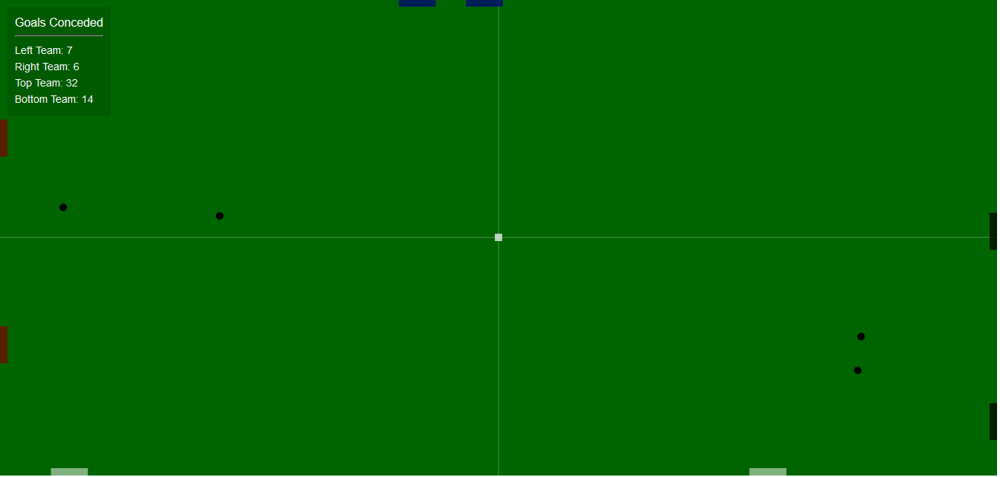

# Ping pong
A 4-way Ping pong animation

Description
-----------
A game of ping pong is played from two opposite sides. However, how will it be like if it is played from all 4 sides?
This simulation sets 4 teams on each side of the ping pong board.  
 

View live demo at : https://codepen.io/niitettehtsuru/pen/KKVpwoy
 
## Getting Started

These instructions will get you a copy of the project up and running on your local machine for development and testing purposes. 

### Prerequisites

All you'll ever need is a working web browser. That's it.

### Installing
Open the index.html file in your web browser. It's that simple. 

 
## Built With

* Pure javascript.   
## Authors

* **Caleb Nii Tetteh Tsuru Addy**   
 
## License

This project is licensed under the GNU General Public License v3.0.
